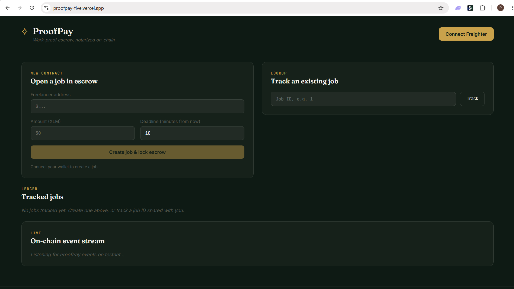
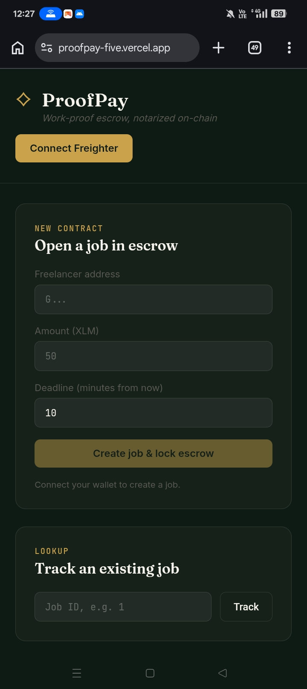
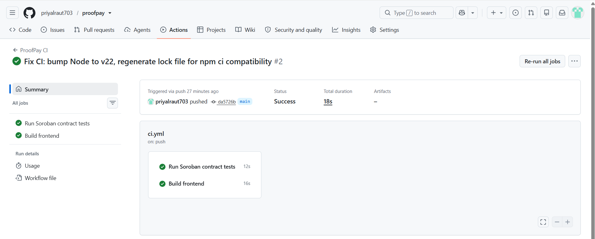
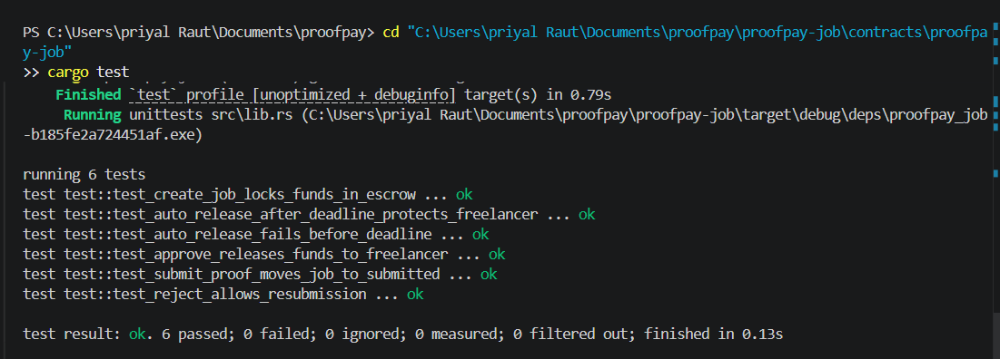
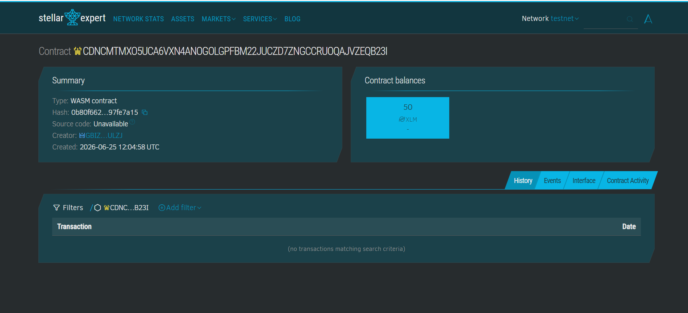
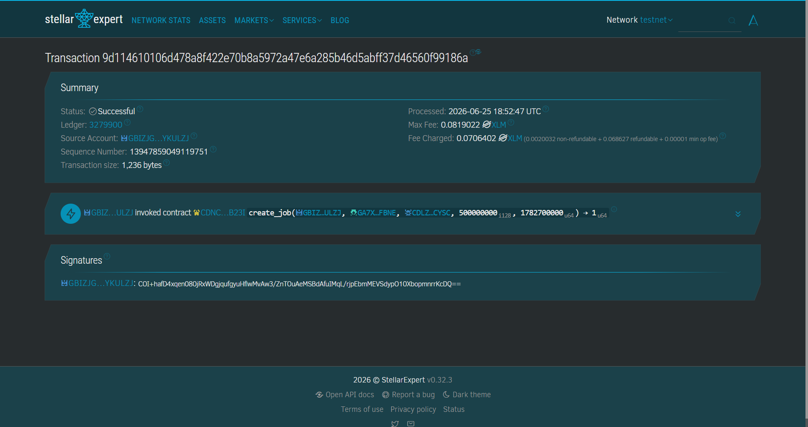

# ProofPay — Work-Proof-Based Escrow on Stellar

ProofPay is an anti-scam escrow system for freelance work, built on Stellar's Soroban smart contract platform. It solves the classic two-sided trust problem in freelancing: clients who refuse to pay after work is delivered, and freelancers who never deliver after being paid.

**Live demo:** https://proofpay-app.vercel.app/
**Demo video:** https://drive.google.com/file/d/1NQa9L_oCQhXf1h3eY6oBbB2UXfov7gP4/view?usp=drive_link
**Contract (Stellar Testnet):** `CDNCMTMXO5UCA6VXN4ANOGOLGPFBM22JUCZD7ZNGCCRUOQAJVZEQB23I`
**Explorer:** https://stellar.expert/explorer/testnet/contract/CDNCMTMXO5UCA6VXN4ANOGOLGPFBM22JUCZD7ZNGCCRUOQAJVZEQB23I

## Screenshots

| | |
|---|---|
| **Desktop UI** | **Mobile UI** |
|  |  |
| **CI/CD Pipeline (Green)** | **Test Output (6 passing)** |
|  |  |
| **Contract on Explorer** | **Transaction: create_job (inter-contract call)** |
|  |  |

---

## The problem

Freelance platforms today rely on a centralized party to mediate disputes. Without that mediator, two failure modes are common:

- A client receives the delivered work, then claims dissatisfaction and refuses to release payment.
- A client pays upfront, and the freelancer never delivers.

ProofPay removes the need to trust either party blindly by combining **escrow**, **on-chain proof submission**, and a **deadline-based auto-release safety net** into a single smart contract.

## How it works

1. **Client creates a job** — locks payment into the contract as escrow, sets a freelancer address and a deadline.
2. **Freelancer submits proof** — a hash of their delivered work (a link, file, or document) is stored on-chain as evidence.
3. **Client approves or rejects**:
   - *Approve* → funds are released to the freelancer immediately.
   - *Reject* → the freelancer can resubmit proof; the job isn't lost.
4. **Auto-release safety net** — if the client never responds after the deadline passes, **anyone** can trigger `auto_release`, which pays the freelancer automatically. A client cannot go silent to avoid paying for delivered work.

This means a freelancer is always protected by the deadline, and a client is always protected by requiring proof before any payout.

## Architecture
┌─────────────────┐         ┌──────────────────────┐         ┌────────────────────┐

│   React Frontend │ ───────▶│  ProofPay Contract   │ ───────▶│  Stellar Token      │

│  (Vite + Freighter)│        │  (Soroban / Rust)    │         │  Contract (XLM SAC) │

└─────────────────┘         └──────────────────────┘         └────────────────────┘

│                              │

│                              ├─ create_job()    → calls token.transfer() [client → escrow]

│                              ├─ submit_proof()  → stores proof hash on-chain

│                              ├─ approve()       → calls token.transfer() [escrow → freelancer]

│                              ├─ reject()         → resets status for resubmission

│                              └─ auto_release()  → calls token.transfer() [escrow → freelancer]

│

└─ Polls Soroban RPC for contract events (job_created, proof_submitted, job_approved, etc.)

to drive a live, real-time event feed in the UI.
The `ProofPay` contract never holds a private custom token — it calls the existing Stellar Asset Contract (SAC) for native XLM, which is itself a deployed Soroban contract. Every payment in or out of escrow is a genuine **inter-contract call**.

## Tech stack

- **Smart contract:** Rust + Soroban SDK 26, compiled to WASM (`wasm32v1-none`)
- **Frontend:** React 19 + Vite, vanilla CSS (no framework), `@stellar/stellar-sdk` for contract calls, `@stellar/freighter-api` for wallet connection
- **Testing:** 6 unit tests covering escrow, proof submission, approval, rejection/resubmission, and both sides of the auto-release window
- **CI/CD:** GitHub Actions — runs contract tests and a frontend production build on every push
- **Deployment:** Vercel (frontend), Stellar Testnet (contract)

## Project structure
proofpay/

├── proofpay-job/              # Soroban smart contract (Rust workspace)

│   └── contracts/proofpay-job/

│       └── src/

│           ├── lib.rs         # Contract logic

│           └── test.rs        # Unit tests

├── proofpay-frontend/         # React + Vite frontend

│   └── src/

│       ├── App.jsx

│       ├── contractClient.js  # Wallet connection + contract call wrapper

│       └── useEvents.js       # Polls Soroban RPC for live contract events

└── .github/workflows/ci.yml   # CI pipeline
## Smart contract: methods

| Method | Caller | Description |
|---|---|---|
| `create_job(client, freelancer, token, amount, deadline)` | Client | Locks `amount` of `token` in escrow, opens a new job |
| `submit_proof(job_id, freelancer, proof_hash)` | Freelancer | Submits a 32-byte hash of delivered work |
| `approve(job_id, client)` | Client | Releases escrowed funds to the freelancer |
| `reject(job_id, client)` | Client | Sends the job back to allow resubmission |
| `auto_release(job_id)` | Anyone | After the deadline, releases funds if the client never responded |
| `get_job_details(job_id)` | Anyone (read-only) | Returns full job state |

## Running locally

### Prerequisites
- Rust (with `wasm32v1-none` target) and the [Stellar CLI](https://developers.stellar.org/docs/tools/stellar-cli)
- Node.js 22+
- [Freighter wallet](https://www.freighter.app/) browser extension

### Smart contract

```bash
cd proofpay-job/contracts/proofpay-job
cargo test                                          # run unit tests
cargo build --target wasm32v1-none --release        # build WASM
stellar contract deploy \
  --wasm ../../target/wasm32v1-none/release/proofpay_job.wasm \
  --source <your-identity> --network testnet
```

### Frontend

```bash
cd proofpay-frontend
npm install
npm run dev
```

The frontend is pre-configured with the deployed testnet contract address in `src/contractClient.js`. To point it at your own deployment, update `PROOFPAY_CONTRACT_ID`.

## Deployed addresses (Stellar Testnet)

| Item | Address |
|---|---|
| ProofPay contract | `CDNCMTMXO5UCA6VXN4ANOGOLGPFBM22JUCZD7ZNGCCRUOQAJVZEQB23I` |
| Native XLM token contract (SAC) | `CDLZFC3SYJYDZT7K67VZ75HPJVIEUVNIXF47ZG2FB2RMQQVU2HHGCYSC` |

## Example transaction (inter-contract call)

A `create_job` call that locks 50 XLM in escrow — note both the `transfer` event (token contract) and the `job_created` event (ProofPay contract) in the same transaction:

https://stellar.expert/explorer/testnet/tx/9d114610106d478a8f422e70b8a5972a47e6a285b46d5abff37d46560f99186a

## Testing

```bash
cd proofpay-job/contracts/proofpay-job
cargo test
```
running 6 tests

test test::test_create_job_locks_funds_in_escrow ... ok

test test::test_auto_release_after_deadline_protects_freelancer ... ok

test test::test_auto_release_fails_before_deadline ... ok

test test::test_approve_releases_funds_to_freelancer ... ok

test test::test_submit_proof_moves_job_to_submitted ... ok

test test::test_reject_allows_resubmission ... ok
test result: ok. 6 passed; 0 failed; 0 ignored; 0 measured; 0 filtered out

## Roadmap / known limitations

See [docs/DESIGN.md](docs/DESIGN.md) for the full design rationale and known limitations, including:

- Proof is currently a hash of arbitrary text (link/description), not a verified file upload — file storage would require an off-chain pinning service (e.g. IPFS) in a production version.
- No partial payments or milestone-based escrow yet — each job is all-or-nothing.
- No dispute arbitration beyond reject/resubmit — a future version could add a third-party arbiter role for genuine disagreements.

## Author

[@priyalraut703](https://github.com/priyalraut703)

## License

MIT